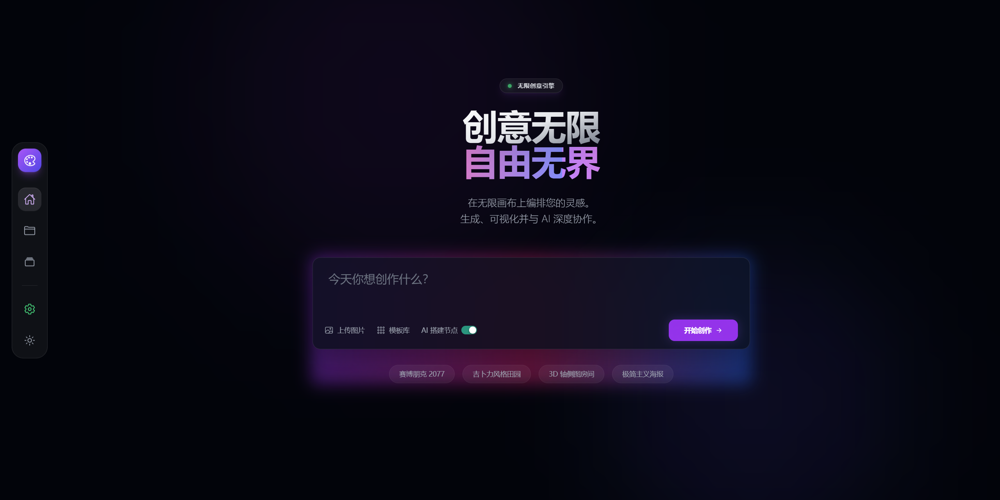
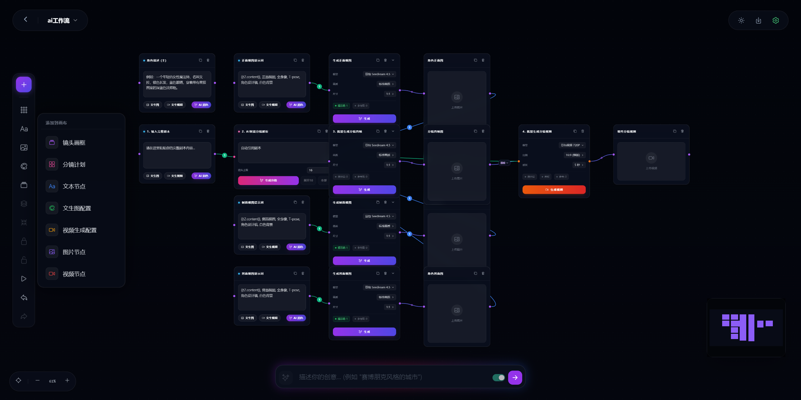
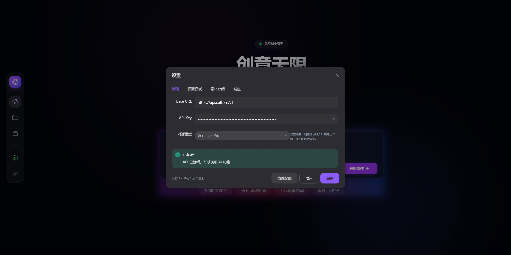

# 云迹无限画布 (Yunji Canvas)

> **作者微信：soe303** | 欢迎交流与合作

推荐另一个画布工具：https://canv.cutb.cn  有兴趣可以看看，可定制


**云迹无限画布** 是一款企业级可视化 AI 工作流编排平台，基于 Vue 3 生态深度打造。通过直观的节点式画布交互，让复杂的 AI 创作流程（文生图、图生视频、多模态处理）变得简单高效。平台内置智能 AI 助手，支持自然语言描述自动生成工作流架构，并提供专业级提示词优化引擎，显著提升创作效率与输出质量。

---

## ✨ 核心特性

### 🎨 可视化工作流编排
- 基于 Vue Flow 引擎的无限画布空间
- 支持节点拖拽、自由缩放、智能连接与自动布局
- 实时预览与调试，所见即所得

### 🤖 AI 智能助手
- **自然语言搭建**: 描述需求即可自动生成完整工作流架构
- **提示词优化引擎**: 内置 LLM 驱动的专业提示词润色工具
- **智能推荐**: 根据上下文推荐最佳节点组合

### 🎬 多模态内容生成
- **图像创作**: 文生图、图生图、图像编辑全流程支持
- **视频制作**: 图片转视频、视频风格化处理
- **扩展节点**: 文本处理、参数配置、多媒体预览等丰富组件

### 📦 企业级项目管理
- 多项目并行管理，工作区隔离
- 工作流模板导入/导出（JSON 格式）
- 本地数据持久化，隐私安全可控

### 💎 极致用户体验
- 响应式设计，适配多种屏幕尺寸
- 亮色/暗色主题自动切换
- 流畅动画与交互反馈

## 🛠 技术栈

| 模块 | 技术选型 | 说明 |
| :--- | :--- | :--- |
| **核心框架** | [Vue 3](https://vuejs.org/) | Composition API |
| **流程引擎** | [Vue Flow](https://vueflow.dev/) | 节点编排与交互核心 |
| **UI 组件库** | [Naive UI](https://www.naiveui.com/) | 现代化 Vue 3 组件库 |
| **样式工具** | [Tailwind CSS](https://tailwindcss.com/) | 原子化 CSS 框架 |
| **构建工具** | [Vite](https://vitejs.dev/) | 极速开发与构建 |
| **HTTP 客户端** | [Axios](https://axios-http.com/) | 网络请求处理 |

## 📸 项目截图

### 首页概览


### 画布编辑


### API 配置


## 📂 目录结构

```
src/
├── api/             # API 接口定义 (Image, Video, Chat 等)
├── components/      # Vue 组件
│   ├── edges/       # 自定义连线组件 (Vue Flow)
│   └── nodes/       # 自定义节点组件 (Vue Flow)
├── config/          # 全局配置文件
├── hooks/           # 组合式函数 (useApiConfig, useWorkflow 等)
├── router/          # 路由配置
├── stores/          # 状态管理 (Reactive / Composition)
├── utils/           # 工具函数库
└── views/           # 页面视图 (Home, Canvas)
```

## 🚀 快速开始

### 📋 环境要求

- **Node.js**: >= 18.0.0
- **包管理器**: npm / pnpm / yarn

### 💻 本地部署教程

#### 方式一：一键启动（推荐）

**Windows 用户**：
1. 双击运行 `启动项目.bat`
2. 脚本将自动检测依赖、安装并启动服务
3. 浏览器自动打开 `http://localhost:5173`

#### 方式二：命令行启动

1. **克隆项目**
   ```bash
   git clone https://github.com/your-username/yunji-canvas.git
   cd yunji-canvas
   ```

2. **安装依赖**
   ```bash
   npm install
   # 或使用 pnpm
   pnpm install
   ```

3. **启动开发服务器**
   ```bash
   npm run dev
   # 或使用 pnpm
   pnpm dev
   ```

4. **访问应用**

   打开浏览器访问 `http://localhost:5173`

### 构建部署

```bash
# 构建生产环境代码
pnpm build

# 预览构建产物
pnpm preview
```

## ⚙️ 配置指南

### 首次使用配置

1. 启动应用后，点击右上角「设置」图标
2. 填写以下配置信息：

| 配置项 | 说明 | 示例 |
|:---|:---|:---|
| **API Base URL** | AI 服务接口地址（支持 OpenAI 兼容格式） | `https://api.openai.com/v1` |
| **API Key** | 你的 API 密钥 | `sk-xxxxxxxxxxxxx` |
| **Chat Model** | 对话模型（用于智能搭建和提示词优化） | `gpt-4` / `gpt-3.5-turbo` |

3. 保存配置后即可开始使用

> 💡 **隐私保护**: 所有配置均存储于本地浏览器 (`localStorage`)，不会上传至任何服务器。

## 🐳 Docker 部署

本项目支持 Docker 快速部署。

详情请参考: [README.docker.md](./README.docker.md)

```bash
# 快速启动
docker-compose up -d --build
```

## 📄 License

本项目采用 [MIT License](LICENSE) 开源。

---
<p align="center">Made with ❤️ by Yunji Team</p>
